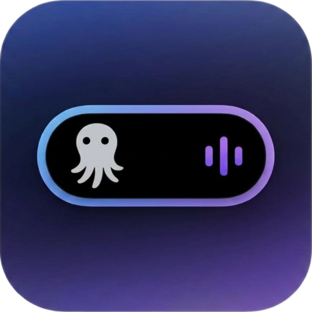

# ZenIsland

<p align="center">
  
</p>

[English](README.md) | [简体中文](README_ZH.md)

ZenIsland 是一个基于 SwiftUI 开发的 macOS 顶部悬浮岛应用，用来聚合展示本机 `Claude Code`、`Codex`、`OpenCode` 等 CLI 会话的状态、审批请求、问答提示、额度窗口和快速回焦入口。

它的目标不是替代终端或桌面客户端，而是在你编码时，把最重要的 CLI 状态持续放到屏幕顶部。

> 本项目 fork 自 [HermitFlow-VibeIsland](https://github.com/0x0Bke/HermitFlow-VibeIsland)，在其基础上改造为 ZenMux 专属版本。

## 名称含义

`ZenIsland` 这个名字来自两个部分：

- `Zen`：代表使用 AI 工具时平静、专注的 Flow 状态，同时也是 ZenMux 的品牌延伸
- `Island`：屏幕顶部的浮动岛，一个自成一体的 CLI 状态展示区

合起来，它描述了一个由 ZenMux 驱动的、专注而精简的 AI Agent 状态面板。

## 当前能力

- 顶部居中的无边框悬浮窗口，自动贴合屏幕安全区与摄像头区域
- 三种展示状态：隐藏态、岛态、展开面板态
- 同时聚合本机 `Claude Code`、`Codex` 与 `OpenCode` 的最近会话
- 展示会话来源、工作目录、运行状态与最近更新时间
- 检测审批请求，并在岛态或面板中直接处理
- 检测 Claude 与 OpenCode 提问卡片，并支持应用内回答
- 岛态审批支持键盘选择与确认
- 支持读取 `Claude Code`、`Codex` 与 `OpenCode` 的额度信息（通过 ZenMux provider）
- 在展开面板中展示 Claude/Codex/OpenCode 额度进度条
- 为 `Claude Code`、`Codex` 与 `OpenCode` 会话提供一键回焦入口
- 状态栏菜单支持显示/隐藏窗口
- 状态栏菜单支持手动执行 `Resync Claude Hooks`
- 面板内置诊断卡片，可直接展示 Claude hook 同步错误
- `Codex CLI` 审批可通过 macOS 辅助功能自动执行
- `Claude Code` 通过本地 hook 接入，审批通过本地 HTTP 回调完成
- `OpenCode` 通过受管全局插件接入，审批和问答通过 ZenIsland 本地监听器完成

## 效果展示

### 空闲


### 详情面板


### 执行中


### 请求审批


### 执行成功


### 问答


### 设置


## 工作方式

### Codex

应用启动后会轮询本机 `~/.codex` 下的状态文件，聚合最近活跃的 Codex 会话，并尽可能识别其来源与回焦目标。当前使用到的数据包括：

- `~/.codex/state_5.sqlite`
- `~/.codex/logs_1.sqlite`
- `~/.codex/sessions/`
- `~/.codex/.codex-global-state.json`
- `~/.codex/log/codex-tui.log`
- `~/.codex/shell_snapshots/`

如果这些文件不存在，ZenIsland 会继续运行，但 Codex 状态会显示为不可用或等待活动。

ZenIsland 也会从本地 rollout 日志中读取 Codex 额度信息：

- `~/.codex/sessions/**/rollout-*.jsonl`

应用会优先扫描较新的 rollout 文件，并提取最近一条有效的本地 `token_count.rate_limits` 数据。如果 rollout 额度数据不存在、损坏或不可用，应用其他功能不受影响，对应额度行会被直接省略。

### Claude Code

ZenIsland 已接入 Claude Code。应用启动时会执行以下初始化动作：

- 启动本地监听器，接收 Claude Code hook 事件
- 在 `~/.zenisland/claude-hooks/` 下写入 hook 脚本
- 自动同步 Claude 配置文件，为 Claude Code 注册所需 hooks

其中：

- 状态事件通过本地 command hook 上报
- 审批请求通过本地 HTTP hook 回调到 ZenIsland
- Claude 提问会通过本地 HTTP hook 镜像到 ZenIsland
- ZenIsland 专用的审批回调路径为 `/permission/zenisland`
- `Elicitation` 回调路径为 `/question/zenisland`
- `AskUserQuestion` 接管回调路径为 `/ask-user/zenisland`
- Claude 审批不依赖 macOS 辅助功能权限

Claude 问答处理支持两种模式：

- `ZenIsland 回答`：拦截 `AskUserQuestion`，可直接在 ZenIsland 中选择预设选项或输入自定义答案，并回传给 Claude
- `Claude 原生回答`：保留 Claude 自己的 `AskUserQuestion` 流程，同时在 ZenIsland 中镜像展示问题，方便你在 Claude CLI 或 Claude 扩展里继续回答

如需查看当前 Claude 状态在代码中的完整流转过程，可参考 [docs/claude-state-flow.zh-CN.md](docs/claude-state-flow.zh-CN.md)。

如果本机没有可执行的 `node`，Claude hook 无法正常工作。

ZenIsland 也支持从自己管理的本地缓存文件读取 Claude 额度：

- `/tmp/zenisland-rl.json`

这个文件是可选的本地产物。ZenIsland 会在 Claude hook 与 `statusLine` bridge 读到兼容的额度字段后自行写入它。如果这个文件不存在，ZenIsland 也可以回退到三方 provider 查询配置：

- `~/.zenisland/claude-provider-usage.json`

### OpenCode

ZenIsland 也通过受管全局插件接入 OpenCode。应用启动时会：

- 启动本地 OpenCode 监听器
- 将受管插件写入 `~/.config/opencode/plugins/zenisland.js`
- 确保 OpenCode 插件包中包含 `@opencode-ai/plugin`

插件会把 session、message、tool、permission 与 question 事件回传给 ZenIsland。本地 OpenCode 监听器暴露：

- `GET /health`
- `POST /opencode/event`
- `GET /opencode/state`
- `GET /opencode/approval-decision`
- `GET /opencode/question-decision`

OpenCode 审批会进入与 Claude、Codex 相同的审批 UI。ZenIsland 会在本地排队审批结果，由 OpenCode 插件轮询取回，因此不依赖 macOS 辅助功能自动化。

OpenCode 问答也会展示在 ZenIsland 的问答 UI 中。受管插件提供了一个 `question` tool，可向用户提出一个或多个结构化问题，并等待 ZenIsland 回传答案。

状态展示优先使用实时插件事件；当 live 事件不可用时，会回退读取本地 OpenCode SQLite 数据库：

- `~/.local/share/opencode/opencode.db`

OpenCode 额度展示基于 provider。ZenIsland 会从本地数据库读取最近的 OpenCode provider/model 上下文，合并全局与项目级 OpenCode 配置，解析 `provider.<id>.options.baseURL` 和 `provider.<id>.options.apiKey`，然后使用共享 provider 额度配置：

- `~/.zenisland/claude-provider-usage.json`

## 运行要求

- macOS
- Xcode
- 本机已安装并使用过 `Codex`、`Claude Code` 或 `OpenCode`
- 如需 Claude Code 集成：系统环境中可执行 `node`
- 如需 OpenCode 集成：本机 OpenCode 需要支持插件机制
- 如需 Codex 自动审批：授予 ZenIsland macOS“辅助功能”权限

## 打开与运行

1. 用 Xcode 打开 [ZenIsland.xcodeproj](ZenIsland.xcodeproj)
2. 选择 `ZenIsland` scheme
3. 直接运行

首次启动时，应用会立即开始：

- 启动本地会话监控
- 尝试接入 Claude Code hooks
- 尝试接入受管 OpenCode 插件
- 检查辅助功能权限状态

如果 Claude hook 初始化失败，应用仍可继续运行，但 Claude Code 状态与审批不会生效。相关错误会出现在面板中的 `Diagnostic` 卡片中。

## 使用方式

- 单击悬浮岛：隐藏态切到岛态，或从岛态展开到面板态
- 双击悬浮岛：从岛态或面板态切回隐藏态
- 展开面板后可查看最近会话、审批请求和会话详情
- 面板内审批卡片可直接点击 `Deny`、`Allow Once`、`Always Allow`
- 当 Claude 或 OpenCode 需要补充信息时，岛态或面板中会出现问答卡片
- 展开面板中还可以查看 `Claude`、`Codex` 和 `OpenCode` 的额度进度条
- 当存在审批请求时，岛态会直接展开为审批卡片
- 当存在 Claude 或 OpenCode 提问时，岛态也可以直接展开为内联问答卡片
- 在岛态审批卡片中，可用 `Left` / `Right` 切换选中的审批动作，按 `Return` 直接确认
- 如果审批是在终端里直接处理的，ZenIsland 会在本地 source 观察到请求已消失或已解决后自动收起审批 UI
- 面板中的 `Diagnostic` 卡片会展示 Claude hook 同步失败原因
- 可在面板或状态栏菜单中点击 `Resync Claude Hooks` 重新同步 Claude hooks
- 可通过会话卡片或审批卡片上的回焦入口，直接拉起对应的 `Claude Code` / `Codex` / `OpenCode` 客户端
- 对于终端会话，ZenIsland 会尝试回焦到对应的 `iTerm`、`Warp`、`Terminal`、`WezTerm`、`Ghostty` 或 `Alacritty` 窗口；其中 `iTerm` / `WezTerm` 会优先使用本地 session hint，其他终端会按工作目录窗口标题做 best-effort 匹配
- 通过系统状态栏图标可显示/隐藏窗口

### 问答处理

ZenIsland 支持 Claude 与 OpenCode 问答。

Claude 问答提供两种工作方式，可在面板的快速设置中切换：

- `ZenIsland 回答`：问答卡片可直接交互，你可以点选推荐选项，或输入自定义回答后直接提交
- `Claude 原生回答`：ZenIsland 只负责镜像展示问题，真正的回答仍需在 Claude CLI 或 Claude 扩展里完成

OpenCode 问答始终通过 ZenIsland 问答卡片处理。答案会先在本地排队，再由 OpenCode 插件通过监听器取回。

### 额度展示

展开面板会在会话卡片区域显示额度信息：

- `Claude`：存在本地 Claude 缓存时展示 `5h` 与 `wk` 两个剩余额度进度条；若命中受支持的三方 Claude provider，也可通过 provider 接口展示
- `Codex`：存在本地 rollout 额度数据时展示 `5h` 与 `wk` 两个剩余额度进度条
- `OpenCode · <Provider>`：当 OpenCode 使用受支持的三方 provider，且 provider quota API 返回兼容数据时展示对应额度窗口

额度展示遵循本地优先和可选降级：

- 没有额度文件：面板正常工作，只是不显示额度行
- 额度文件损坏或格式不兼容：面板正常工作，只是不显示对应 provider 的额度行
- 若识别到受支持的三方 provider 且远程额度查询成功：Claude 行/卡片会显示为 `Claude · <Provider>`，OpenCode 行/卡片会显示为 `OpenCode · <Provider>`
- 若 `~/.zenisland/claude-provider-usage.json` 顶层配置了命令式额度查询：ZenIsland 会用这个命令获取 Claude 与 OpenCode provider 额度
- 若该命令执行失败、超时或返回非法百分比：对应额度行会直接隐藏，且不会回退到 provider HTTP 接口

当前 UI 默认展示剩余额度，也可以在设置中切换为展示已使用额度。

对于 Claude，是否能显示额度取决于本地 payload 形状、`~/.zenisland/claude-provider-usage.json` 顶层命令式额度查询结果或受支持 provider 的响应结构。只有当上游 payload 提供官方 Claude 风格的 `rate_limits.five_hour` 与 `rate_limits.seven_day`，或者三方 provider 响应能被映射为兼容窗口时，ZenIsland 才会显示 `5h` / `wk`。如果命令式查询返回的是 `day` 这类自定义窗口，Claude UI 会只显示该自定义标签，而不再显示默认的 `5h` / `wk`。某些第三方 Anthropic 兼容模型只提供 context window 信息，或者完全不提供 rate limit 字段，此时 Claude 活动和审批仍然可用，但 Claude 额度不会显示。

对于 OpenCode，是否能显示额度取决于最近 OpenCode provider/model 上下文、合并后的 OpenCode 配置、可解析的 `provider.<id>.options.apiKey`，以及同一份 `~/.zenisland/claude-provider-usage.json` 中的 provider 定义。如果 token 只存储在 OpenCode account flow 中，而无法从配置解析，OpenCode 活动、审批和问答仍然可用，但 OpenCode 额度不会显示。

### 三方 Provider 额度

ZenIsland 可以通过以下信息识别受支持的 Claude 三方 provider：

- `ANTHROPIC_BASE_URL`
- `ANTHROPIC_MODEL`
- 最近一次受管 Claude `statusLine` payload

对于 OpenCode，ZenIsland 会通过最近的 OpenCode provider/model 上下文与合并后的 OpenCode 配置识别受支持的三方 provider。

Claude 与 OpenCode 共用同一个 provider 额度配置文件：

- `~/.zenisland/claude-provider-usage.json`

首次启动会自动写入默认模板，内置 ZenMux provider：

- `ZenMux`: `https://zenmux.ai/api/v1/management/subscription/detail`

这个配置文件可定义：

- 一个可选的顶层命令式额度查询
- 一组 provider 匹配规则和 HTTP 额度查询定义

每个 provider 配置项可定义：

- 如何识别该 provider
- 该调用哪个额度接口
- 认证 header 名称和前缀如何拼装
- 请求头、query、body 如何构造
- `Authorization: Bearer <token>` 应读取哪个 `authEnvKey`
- 如何把 provider 响应映射成 `5h` / `wk` 或自定义额度窗口

对 OpenCode 来说，provider 匹配除了 base URL 和 model prefix，也可以使用 `providerIDs`。OpenCode token 会优先从 `opencode.json/jsonc` 的 provider options 读取，并支持 `{env:NAME}` 与 `{file:path}` 替换。

当额度只能通过本地 CLI 包装查询时，可以在配置文件顶层写命令式查询。只要顶层 `usageCommand` 存在，ZenIsland 就会跳过 provider 识别，只执行这个命令来获取 provider 额度。例如：

```json
{
  "usageCommand": {
    "command": "echo '{}' | ~/xxx/hook-cli cc_statusLine | awk '{print $NF}'",
    "window": "day",
    "valueKind": "usedPercentage",
    "displayLabel": "day",
    "timeoutSeconds": 5
  },
  "providers": []
}
```

`valueKind` 当前支持：

- `usedPercentage`：命令输出本身就是已用比例/百分比
- `remainingPercentage`：命令输出是剩余比例/百分比，ZenIsland 会在内部转换成已用比例

对于 Claude，`authEnvKey` 支持两种写法：

- Claude `settings.json.env` 中的环境变量名
- 直接写真实 token，例如 `sk-...`

对于 OpenCode，`authEnvKey` 可以是 `apiKey`、OpenCode 配置中解析出的 token，或环境变量名。共享 Claude 默认配置中的 `ANTHROPIC_AUTH_TOKEN` 在 OpenCode 路径中会被解释为“使用 OpenCode provider API key”。

如果 `~/.zenisland/claude-provider-usage.json` 已经存在，ZenIsland 不会自动覆盖它。默认接口变更后，需要手动更新本地文件。

ZenIsland 内置了 ZenMux 的 provider-specific 解析逻辑，会解析 `data.quota_5_hour` 和 `data.quota_7_day`。

## 权限与配置

### 辅助功能权限

只有 `Codex CLI` 的自动审批依赖 macOS“辅助功能”权限。未授权时，ZenIsland 会在面板中显示提示，并提供打开系统设置入口。

### Claude 配置写入

为了接入 Claude Code，ZenIsland 默认会更新 `~/.claude/settings.json` 中的 `hooks` 配置，并写入自己的本地 hook 脚本。如果你有自定义 Claude hooks，ZenIsland 会尝试增量更新自身相关条目，而不是覆盖整个配置文件。

当前支持的写入目标包括：

- 默认路径：`~/.claude/settings.json`
- 额外路径配置文件：`~/.zenisland/claude-settings-paths.json`
- 额外环境变量：`ZENISLAND_CLAUDE_SETTINGS_PATHS`

`~/.zenisland/claude-settings-paths.json` 支持两种格式：

- JSON 数组，例如 `["~/custom-claude/settings.json", "/opt/company/claude/settings.json"]`
- 对象形式，例如 `{"paths":["~/custom-claude/settings.json","/opt/company/claude/settings.json"]}`

环境变量 `ZENISLAND_CLAUDE_SETTINGS_PATHS` 支持使用换行或分号分隔多条路径。

默认路径 `~/.claude/settings.json` 始终会保留在同步列表中。

这些 settings 路径也会用于推导本地 Claude 会话数据目录。比如配置 `~/custom-claude/settings.json` 后，ZenIsland 会额外读取 `~/custom-claude/sessions`、`~/custom-claude/projects` 和 `~/custom-claude/history.jsonl`。如果额外路径配置无法解析，会话读取会回退到默认 `~/.claude`。

另外，以下特殊情况也会被安全处理：

- 自定义 `settings.json` 不存在：会自动创建
- 自定义 `settings.json` 是空文件：会按空对象 `{}` 处理后写入
- `claude-settings-paths.json` 带有常见的尾随逗号：会做兼容解析

### OpenCode 插件写入

为了接入 OpenCode，ZenIsland 只会写入自己的受管全局插件文件：

- `~/.config/opencode/plugins/zenisland.js`

它不会修改项目级 `.opencode/` 目录。受管插件文件带有 marker，可由 ZenIsland 安全重建。本地自定义 OpenCode 插件应使用其他文件名。

## 打包

仓库内置了本地打包脚本：

```bash
./scripts/package.sh
```

默认会按当前机器架构生成 `Release` 版本，输出文件名格式为 `ZenIsland-<arch>.app` 和 `ZenIsland-<arch>.pkg`。

例如在 Apple Silicon 机器上会输出：

- `dist/ZenIsland-arm64.app`
- `dist/ZenIsland-arm64.pkg`

如果要在 Apple Silicon 机器上打 Intel (`x86_64`) 安装包：

```bash
./scripts/package.sh Release intel
```

会输出：

- `dist/ZenIsland-intel.app`
- `dist/ZenIsland-intel.pkg`

如需打 `Debug` 包：

```bash
./scripts/package.sh Debug
```

如需基于现有 `.app` 生成 `dmg`：

```bash
./scripts/package-dmg.sh
```

如需生成 Intel (`x86_64`) `dmg`：

```bash
./scripts/package-dmg.sh Release intel
```

## 工程结构

- `ZenIsland.xcodeproj`：Xcode 工程
- `DynamicCLIIsland/`：主应用源码
- `DynamicCLIIsland/App/`：应用环境与启动装配
- `DynamicCLIIsland/Core/`：共享模型、reducer、协议、工具与事件定义
- `DynamicCLIIsland/State/`：应用级、运行时和展示层 store
- `DynamicCLIIsland/Views/`：SwiftUI 界面
- `DynamicCLIIsland/Views/Approval/`：审批相关视图
- `DynamicCLIIsland/Views/Diagnostics/`：诊断相关视图
- `DynamicCLIIsland/Views/Usage/`：本地额度卡片与摘要视图
- `DynamicCLIIsland/Stores/`：状态聚合与 UI 状态管理
- `DynamicCLIIsland/Sources/`：本地 Claude / Codex / OpenCode 数据源与 hook 接入逻辑
- `DynamicCLIIsland/Services/`：窗口回焦、审批执行、诊断、额度与系统交互
- `DynamicCLIIsland/Coordinators/`：窗口、菜单栏和监控协调器
- `DynamicCLIIsland/Legacy/`：重构过程中保留的兼容适配层
- `DynamicCLIIsland/Resources/`：应用使用的图片资源与资源授权文件
- `scripts/package.sh`：本地打包脚本
- `scripts/package-dmg.sh`：本地 DMG 打包脚本
- `dist/`：打包输出目录

## 已知边界

- ZenIsland 依赖本机现有的 Claude / Codex / OpenCode 数据与进程环境，不提供远程同步
- 额度信息依赖本地缓存、rollout 文件或 provider 查询，即使已安装 Claude / Codex / OpenCode，也可能暂时没有可展示的额度数据
- Claude 额度依赖本地 Claude payload 的字段形状；某些第三方 Anthropic 兼容 provider 不会暴露 `5h` / `7d` rate limit 窗口
- Claude Code 集成依赖本地 hook 机制和 `node`
- OpenCode 集成依赖 OpenCode 插件机制和本地插件事件投递
- OpenCode 额度依赖 OpenCode 配置中可解析的 provider API key；只保存在 OpenCode account 状态中的 token 可能无法被 ZenIsland 读取
- Codex 自动审批依赖辅助功能权限以及终端前台控制能力
- 如果其他电脑已经装了 Node，但 ZenIsland 仍提示 `Node.js is unavailable for the managed Claude hook script`，通常是因为应用从 Finder / LaunchServices 启动时拿到的 `PATH` 不包含 `nvm`、`fnm`、`asdf`、`Volta` 或 `mise` 注入的路径。新版本会主动探测这些常见安装位置并回退到登录 shell；旧版本可先把 `node` 暴露到稳定路径，例如 `/opt/homebrew/bin/node`、`/usr/local/bin/node` 或 `~/.volta/bin/node`，然后执行一次 `Resync Claude Hooks`。
- 如果 CLI 会话已经退出、窗口已关闭，部分“回到会话”入口可能不可用
- 如果目标 Claude 配置文件本身不是合法 JSON 对象，ZenIsland 不会强行覆盖该文件

## License

源代码采用 [MIT License](LICENSE) 进行授权。

本项目 fork 自 [HermitFlow-VibeIsland](https://github.com/0x0Bke/HermitFlow-VibeIsland)，原项目同样采用 MIT License。

- 第三方贡献内容的版权归各自作者所有。
